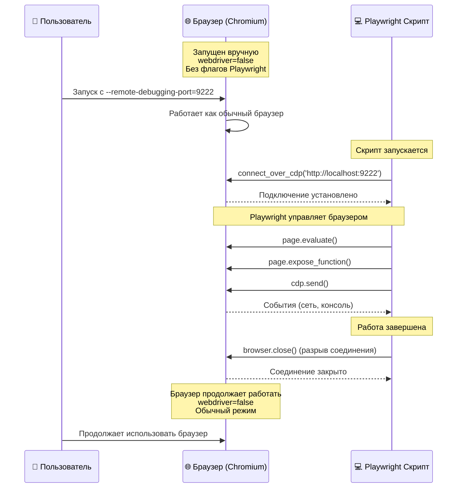

# Диаграмма 1: Стандартный запуск Playwright

```mermaid
sequenceDiagram
    participant User as 👤 Пользователь
    participant Browser as 🌐 Браузер (Chromium)
    participant PW as 💻 Playwright Скрипт

    Note over Browser: Запущен вручную<br/>webdriver=false<br/>Без флагов Playwright

    User->>Browser: Запуск с --remote-debugging-port=9222
    Browser->>Browser: Работает как обычный браузер

    Note over PW: Скрипт запускается

    PW->>Browser: connect_over_cdp('http://localhost:9222')
    Browser-->>PW: Подключение установлено

    Note over PW,Browser: Playwright управляет браузером

    PW->>Browser: page.evaluate()
    PW->>Browser: page.expose_function()
    PW->>Browser: cdp.send()
    Browser-->>PW: События (сеть, консоль)

    Note over PW: Работа завершена

    PW->>Browser: browser.close() (разрыв соединения)
    Browser-->>PW: Соединение закрыто

    Note over Browser: Браузер продолжает работать<br/>webdriver=false<br/>Обычный режим

    User->>Browser: Продолжает использовать браузер
```